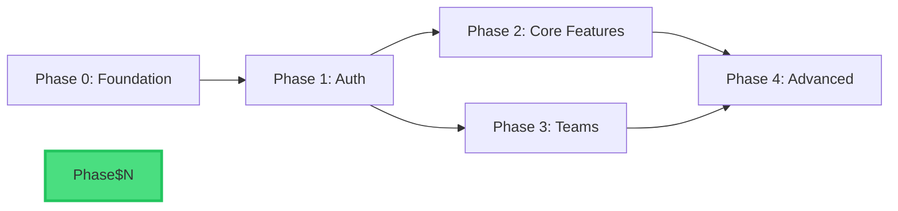

# Phase Manager - Break Project into Phases

**Usage:** `/2_pm <phase description or feature to implement>`

---

## STEP 1: READ PROJECT CONTEXT

Read these docs **in order**:

```bash
# Project foundation
cat docs/1_PROJECT_OVERVIEW.md    # Goals, features, scope
cat docs/2_ARCHITECTURE.md        # Tech stack, components, APIs
cat docs/3_DESIGN_SYSTEM.md       # UI/UX design standards (if exists)
cat docs/4_QUALITY_ASSURANCE.md   # Testing & quality requirements
cat docs/HANDOFF_NOTES.md         # Recent work & current state

# Existing phases
ls docs/Phase*/
cat docs/Phase*/PHASE_PRD.md      # What's already planned
```

**Understand:**
- Project tech stack
- Core architecture
- Existing phases (if any)
- What's been done vs. what's left

---

## STEP 2: ANALYZE REQUEST

**Determine phase number:**
```bash
# Count existing phases
ls docs/Phase\ */ 2>/dev/null | wc -l
# Next phase = count + 1
```

**Scope this phase:**
```
📋 PHASE [N]: [FEATURE_NAME]

What: [USER_REQUEST_SUMMARY]
Type: [FRONTEND/BACKEND/FULLSTACK/INFRASTRUCTURE]
Depends on: [Phase X completed or "None"]
Estimate: [X-Y hours]
```

---

## STEP 3: PLAN PHASE BREAKDOWN

**For Phase [N], create:**

1. **Core Epic** - Main feature work (60-70% of effort)
2. **Infrastructure** - Setup, config, dependencies (10-15%)
3. **Testing** - Unit, integration, E2E (15-20%)
4. **Documentation** - Update docs, handoff notes (5-10%)

**Task Guidelines:**
- Each task = 1-2 hours
- 5-10 files max per task
- Clear acceptance criteria
- Reference existing patterns from 2_ARCHITECTURE.md

---

## STEP 4: GENERATE PHASE DOCS

Create 3 documents using templates:

**3 files to create:**

1. **PHASE_PRD.md** - Product requirements
   - Problem, why now, impact
   - User stories (As a/I want/So that)
   - Functional & non-functional requirements
   - Scope, dependencies, risks

2. **PHASE_TASKS.md** - Task checklist
   - Epics broken into tasks with [ ] checkboxes
   - Each task has subtasks
   - Organized by area (Backend, Frontend, Testing)
   - Notes section for blockers

3. **PHASE_IMP.md** - Implementation guide
   - Setup commands
   - Code snippets
   - Database migrations
   - API endpoints
   - Test & deploy steps

---

## STEP 5: CREATE PHASE FOLDER & FILES

```bash
# Create phase folder
mkdir -p "docs/Phase [N]"

# Copy template files
cp templates/docs/Phase\ \[N\]/PHASE_PRD.md "docs/Phase [N]/"
cp templates/docs/Phase\ \[N\]/PHASE_TASKS.md "docs/Phase [N]/"
cp templates/docs/Phase\ \[N\]/PHASE_IMP.md "docs/Phase [N]/"
```

**Update each file with real content:**

### PHASE_PRD.md
```
📝 Updating: docs/Phase [N]/PHASE_PRD.md

- Replace [PHASE_NAME] with feature name
- Fill problem statement from user request
- Write user stories based on requirements
- List functional requirements
- Add non-functional requirements (perf, security)
- Define scope (in/out)
- List dependencies from 2_ARCHITECTURE.md
- Note risks specific to this phase

✅ PHASE_PRD.md complete
```

### PHASE_TASKS.md
```
📝 Updating: docs/Phase [N]/PHASE_TASKS.md

- Break work into 3-5 epics
- Each epic has 2-5 main tasks
- Each task has 2-4 subtasks
- Use [ ] checkboxes for all items
- Organize by: Infrastructure → Backend → Frontend → Testing
- Add blockers/dependencies at bottom
- Estimate 1-2 hours per task

✅ PHASE_TASKS.md complete
```

### PHASE_IMP.md
```
📝 Updating: docs/Phase [N]/PHASE_IMP.md

- Add setup commands from project
- Document database migrations (if any)
- Add backend implementation code snippets
- Add frontend component examples
- Document API endpoints
- Include test commands
- Add deployment steps

✅ PHASE_IMP.md complete
```

---

## STEP 6: GENERATE DEPENDENCY GRAPH

**Create visual dependency diagram:**

```bash
# Create dependencies diagram
cat > "docs/Phase $N/DEPENDENCIES.md" << 'EOF'
# Phase Dependencies

## Dependency Graph



## Phase Relationships

| Phase | Depends On | Blocks |
|-------|------------|--------|
| Phase 0 | None | Phase 1 |
| Phase 1 | Phase 0 | Phase 2, Phase 3 |
| Phase 2 | Phase 1 | Phase 4 |
| Phase 3 | Phase 1 | Phase 4 |
| Phase 4 | Phase 2, Phase 3 | None |

## Critical Path

The critical path for project completion:
```
Phase 0 → Phase 1 → Phase 2 → Phase 4
```

**Estimated Timeline:** [CALCULATE_FROM_PHASE_ESTIMATES]

---

**Note:** Update this diagram when planning new phases to maintain accurate dependency tracking.
EOF

echo "✅ Created dependency diagram at docs/Phase $N/DEPENDENCIES.md"
```

---

## STEP 7: OUTPUT SUMMARY

```
✅ PHASE [N] COMPLETE

📁 Created:
docs/Phase [N]/
  ├─ PHASE_PRD.md (requirements)
  ├─ PHASE_TASKS.md (checklist)
  ├─ PHASE_IMP.md (implementation)
  └─ DEPENDENCIES.md (dependency graph)

📊 Summary:
- Feature: [FEATURE_NAME]
- Epics: [NUMBER]
- Tasks: [NUMBER] (1-2 hrs each)
- Total: [X-Y hours]

🔗 Dependencies:
- Requires: [Phase X or "None"]
- Blocks: [Phase Y or "None"]
- View graph: docs/Phase [N]/DEPENDENCIES.md

🎯 Next:
Use /3_dev to start implementing Phase [N]
```

---

## GUIDELINES

**Scale to Complexity:**
- Small features may only need PHASE_TASKS.md. Skip the PRD and IMP if the work is straightforward and the tasks speak for themselves.
- Medium features benefit from all 3 docs but keep them concise.
- Large features or architectural changes warrant detailed PRDs, implementation guides, and dependency graphs.
- Use judgment -- the goal is clarity for the next `/3_dev` session, not paperwork.

**Reading Project Docs:**
- Extract tech stack from 2_ARCHITECTURE.md
- Find existing patterns to reuse
- Check what's in vs. out of scope from 1_PROJECT_OVERVIEW.md
- Respect quality level set in 4_QUALITY_ASSURANCE.md

**Task Sizing:**
- 1-2 hours per task
- Independently testable
- Clear file list
- Specific acceptance criteria

**Template Usage:**
- Keep structure from templates
- Fill all sections (no [PLACEHOLDERS])
- Match project's tech stack
- Reference actual file paths

**Phase Organization:**
- Phase 0: Foundation/setup (if needed)
- Phase 1+: Feature implementation
- Each phase: Standalone, deliverable chunk
- Dependencies clearly noted

**Content Quality:**
- Write for AI agents (clear, actionable)
- Use project-specific examples
- Include code snippets where helpful
- Reference existing patterns from codebase

---

## TROUBLESHOOTING

**If no `/1_start` docs exist:**
- Error: "Run /1_start first to initialize project"

**If request is too vague:**
- Ask clarifying questions
- Example: "Is this a new feature or refactor?"

**If request is too large:**
- Break into multiple phases
- Example: "This needs 2 phases: Phase N (backend), Phase N+1 (frontend)"

**If dependencies unclear:**
- Check 2_ARCHITECTURE.md for component relationships
- Review existing phases for what's done

---

**Input:** [USER_PHASE_DESCRIPTION]  
**Start at:** STEP 1: READ PROJECT CONTEXT
