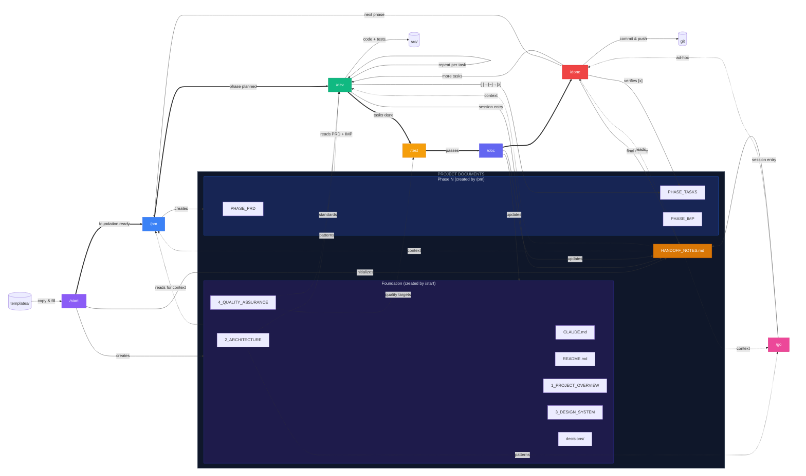
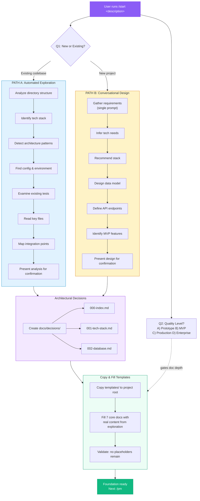
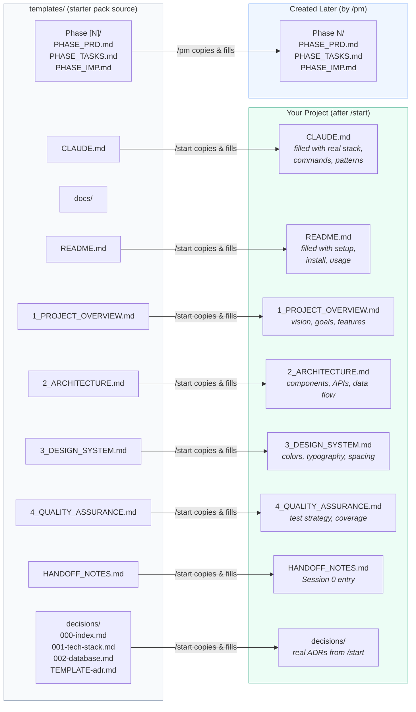
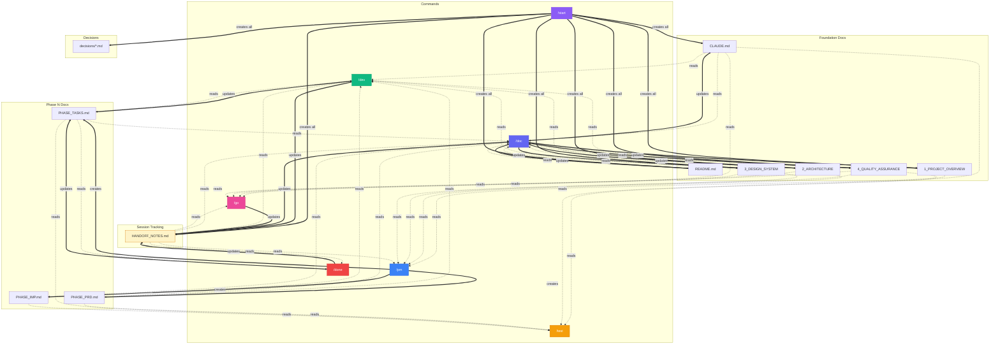
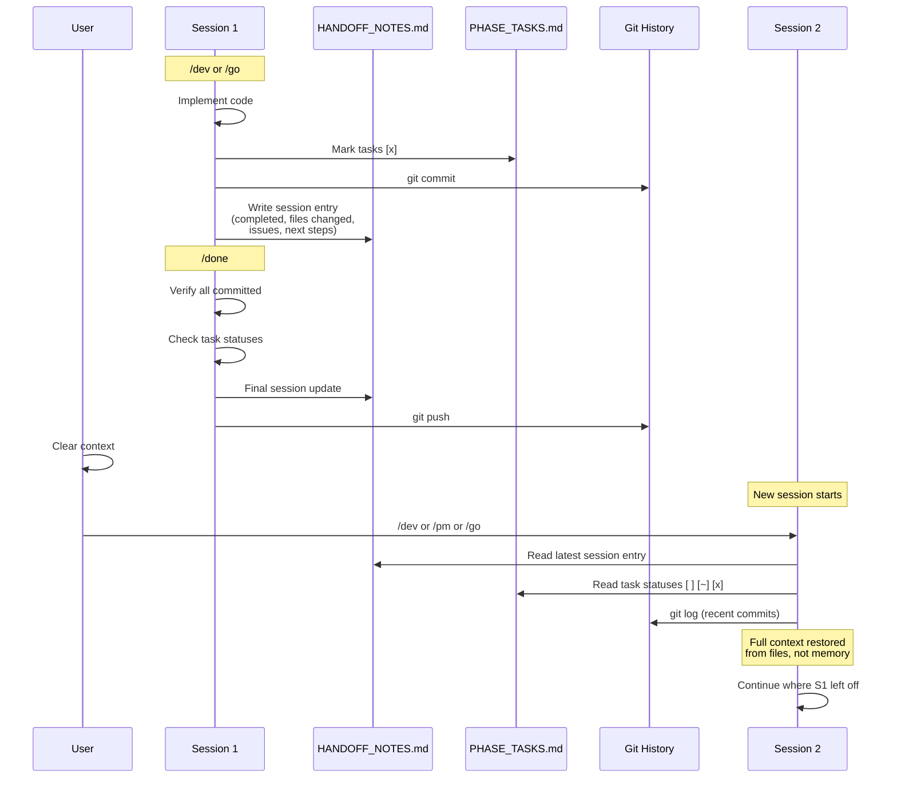
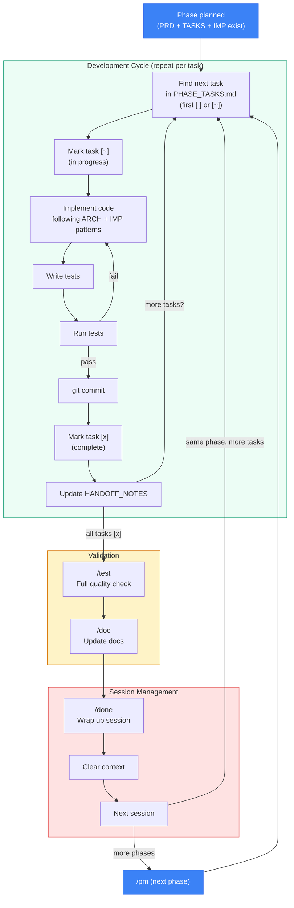
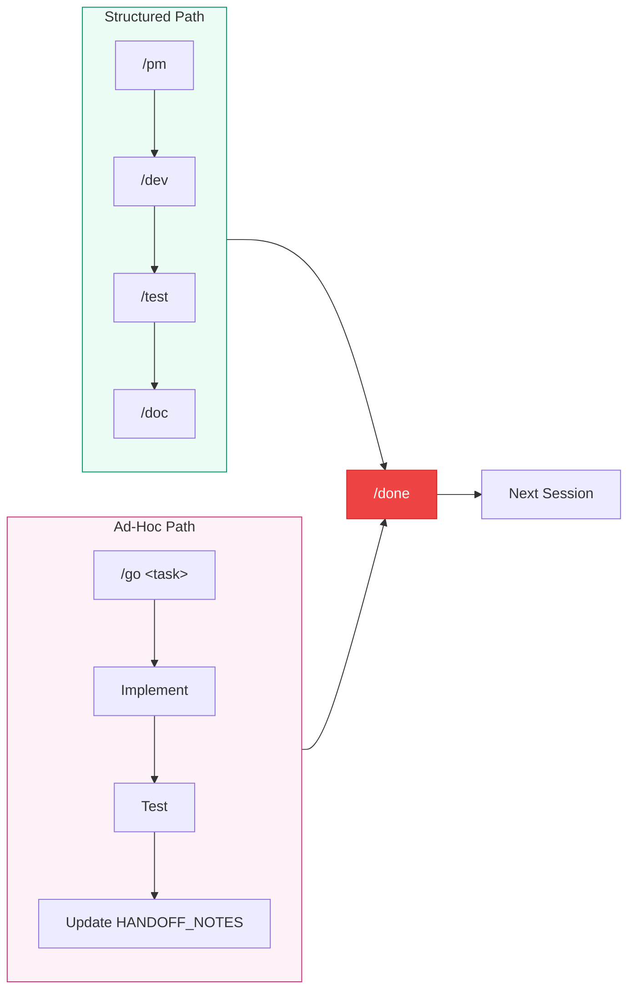

# Starter Pack Workflow

Visual guide to how all commands, templates, documents, and sessions interconnect.

---

## 1. Master Lifecycle

The complete picture: commands, documents they produce, and how everything connects across sessions.



---

## 2. Project Initialization (`/start`)

Two entry paths depending on whether you have an existing codebase or are starting fresh.



---

## 3. Template Flow

What gets copied from `templates/` and becomes the project's living documentation.



---

## 4. Command Data Flow

Which files each command **reads** vs **writes**. This is the core interconnection map.



---

## 5. Session Lifecycle

How HANDOFF_NOTES.md bridges context across sessions when the conversation is cleared.



---

## 6. The Development Loop

The inner cycle that repeats for each phase until all tasks are done.



---

## 7. File Relationship Matrix

Quick reference: what each command reads and writes.

| | CLAUDE | README | 1_OVERVIEW | 2_ARCH | 3_DESIGN | 4_QA | HANDOFF | TASKS | PRD | IMP | ADRs |
|---|:---:|:---:|:---:|:---:|:---:|:---:|:---:|:---:|:---:|:---:|:---:|
| **/start** | **W** | **W** | **W** | **W** | **W** | **W** | **W** | | | | **W** |
| **/pm** | | | R | R | R | R | R | **W** | **W** | **W** | |
| **/dev** | R | | | R | R | R | R **W** | R **W** | R | R | |
| **/test** | R | | | | | R | | R | R | R | |
| **/doc** | R **W** | R **W** | R **W** | R **W** | R **W** | R **W** | R **W** | R | R | R | |
| **/go** | R | | | R | R | R | R **W** | | | | |
| **/done** | | | | | | | R **W** | R **W** | | | |

**R** = reads | **W** = writes | **R W** = reads and writes

---

## 8. Quality Level Scaling

The Q2 answer from `/start` influences how much ceremony each command applies.

```mermaid
flowchart LR
    subgraph PROTO["A) Prototype"]
        P1["CLAUDE.md"]
        P2["README.md"]
        P3["2_ARCHITECTURE.md<br/>(light)"]
        P4["HANDOFF_NOTES.md"]
    end

    subgraph MVP["B) MVP"]
        M1["All core docs"]
        M2["1-2 ADRs"]
        M3["Concise content"]
    end

    subgraph PROD["C) Production"]
        PR1["Full doc set"]
        PR2["Thorough ADRs"]
        PR3["Detailed standards"]
    end

    subgraph ENT["D) Enterprise"]
        E1["Comprehensive docs"]
        E2["All ADRs"]
        E3["Security considerations"]
        E4["Detailed quality gates"]
    end

    PROTO --- MVP --- PROD --- ENT

    style PROTO fill:#fef3c7,stroke:#d97706
    style MVP fill:#e0f2fe,stroke:#0284c7
    style PROD fill:#ecfdf5,stroke:#059669
    style ENT fill:#f3e8ff,stroke:#9333ea
```



**How this affects each command:**

| Command | Prototype | MVP | Production | Enterprise |
|---------|-----------|-----|------------|------------|
| /start | 3-4 docs, skip design system & detailed ADRs | Standard doc set, concise | Full docs, thorough ADRs | Deep analysis, security, compliance |
| /pm | TASKS only for simple features | All 3 docs, concise | All 3 + dependency graph | Detailed PRD, risk analysis |
| /dev | Implement + quick verify | Implement + unit tests | Full tests + patterns | Tests + security + perf |
| /test | Quick smoke test | Unit + integration | Full suite + E2E | Full suite + security + perf + logs |
| /doc | Update what changed | Check related docs | Cross-doc consistency | Full sweep |
| /done | Git commit + handoff note | + task status + sync | + build check | + full validation |

---

## 9. Ad-Hoc Work (`/go`)

`/go` operates outside the phase structure but follows the same standards.



**Key difference:** `/go` is user-directed and not tied to PHASE_TASKS.md. Use it for bug fixes, experiments, refactoring, or anything outside the current phase plan. Same quality standards apply.

---

## 10. Complete File Tree (After Full Setup)

```
project/
├── CLAUDE.md                              ← AI agent guide (filled by /start)
├── README.md                              ← Project readme (filled by /start)
│
├── .claude/
│   └── commands/                          ← Slash commands (from starter pack)
│       ├── 1_start.md                        /start
│       ├── 2_pm.md                           /pm
│       ├── 3_dev.md                          /dev
│       ├── 4_test.md                         /test
│       ├── 5_doc.md                          /doc
│       ├── 6_go.md                           /go
│       └── 7_done.md                         /done
│
├── docs/
│   ├── 1_PROJECT_OVERVIEW.md              ← Vision, goals, features
│   ├── 2_ARCHITECTURE.md                  ← Tech stack, components, APIs
│   ├── 3_DESIGN_SYSTEM.md                 ← Colors, typography, spacing
│   ├── 4_QUALITY_ASSURANCE.md             ← Test strategy, coverage targets
│   ├── HANDOFF_NOTES.md                   ← Session-by-session tracking
│   │
│   ├── decisions/                         ← Architectural Decision Records
│   │   ├── 000-index.md
│   │   ├── 001-tech-stack-selection.md
│   │   ├── 002-database-choice.md
│   │   └── ...
│   │
│   ├── Phase 1/                           ← Created by /pm
│   │   ├── PHASE_PRD.md                      Requirements & user stories
│   │   ├── PHASE_TASKS.md                    Checkbox task list
│   │   ├── PHASE_IMP.md                      Implementation guide
│   │   └── DEPENDENCIES.md                   Phase dependency graph
│   │
│   ├── Phase 2/                           ← Created by next /pm
│   │   └── ...
│   └── ...
│
├── src/                                   ← Your actual code
│   └── ...                                   (built by /dev and /go)
│
└── templates/                             ← Starter pack originals
    ├── CLAUDE.md                             (copied to root by /start)
    ├── README.md
    └── docs/
        └── ...
```

---

## Quick Reference

```
/start ─── Creates foundation ──────────────────────────── One time
/pm ────── Plans a phase ───────────────────────────────── Per feature
/dev ───── Implements tasks ─── ↺ repeat ───────────────── Per task
/test ──── Validates quality ───────────────────────────── Per phase
/doc ───── Updates docs ────────────────────────────────── After /test
/go ────── Ad-hoc work ─────────────────────────────────── Anytime
/done ──── Wraps up session ────────────────────────────── Before context clear
```
