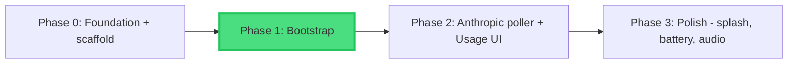
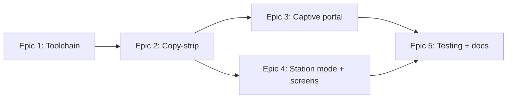

# Phase Dependencies

## Dependency Graph



"Phase 0" is the `/1_start` foundation work (docs, ADRs, the `m5clawd/`
scaffold) — already complete and committed.

## Phase Relationships

| Phase   | Depends On | Blocks   | Status      |
| ------- | ---------- | -------- | ----------- |
| Phase 0 | None       | Phase 1  | Complete    |
| Phase 1 | Phase 0    | Phase 2  | Planning    |
| Phase 2 | Phase 1    | Phase 3  | Not started |
| Phase 3 | Phase 2    | None     | Not started |

## Intra-Phase Dependencies (Phase 1 epics)



- **Epic 1 (Toolchain)** gates everything — a working `arduino-cli` build is
  required before any code can be compiled or flashed.
- **Epic 2 (Copy-strip)** must produce a clean-compiling skeleton before the
  captive portal (Epic 3) and station mode (Epic 4) can be built on it.
- **Epics 3 and 4** are largely independent and could be worked in either order
  (or in parallel worktrees) once Epic 2 lands.
- **Epic 5 (Testing + docs)** needs both 3 and 4 done.

## Critical Path

```
Phase 0 → Phase 1 Epic 1 → Epic 2 → Epic 3/4 → Epic 5 → Phase 2 → Phase 3
```

The single highest-risk node on the path is **Phase 1 Epic 1, Task 1.1** —
validating `arduino-cli` against the pinned ESP32 core 1.0.4 (ADR 001). It is
sequenced first deliberately so a toolchain problem surfaces before any effort
is sunk into the strip.

**Estimated timeline:** Phase 1 ≈ 1 week at evening/weekend pace (~16 tasks,
1-2 h each). Phases 2 and 3 are not yet broken down — run `/2_pm` for each when
Phase 1 completes.

---

**Note:** Update this graph when planning Phase 2 and Phase 3.
