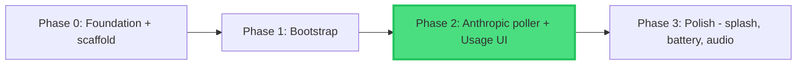
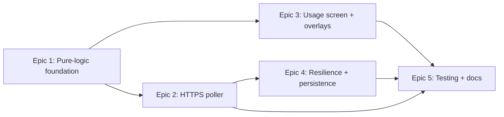

# Phase Dependencies

## Dependency Graph



"Phase 0" is the `/1_start` foundation work (docs, ADRs, the `m5clawd/`
scaffold). Phase 1 (bootstrap — copy-strip, captive portal, WiFi) is complete
and hardware-validated. Phase 2 completes the MVP.

## Phase Relationships

| Phase   | Depends On | Blocks   | Status      |
| ------- | ---------- | -------- | ----------- |
| Phase 0 | None       | Phase 1  | Complete    |
| Phase 1 | Phase 0    | Phase 2  | Complete    |
| Phase 2 | Phase 1    | Phase 3  | Planning    |
| Phase 3 | Phase 2    | None     | Not started |

## Intra-Phase Dependencies (Phase 2 epics)



- **Epic 1 (Pure-logic foundation)** gates everything — it defines `usage_data.h`
  (the shared `UsageData`), the header parser, the formatters, and the
  poll-state machine. Both the poller and the UI consume these.
- **Epic 2 (HTTPS poller)** depends on Epic 1's parser and state machine. Its
  first task (TLS root CA validation) is the phase's highest-risk node.
- **Epic 3 (Usage screen)** depends on Epic 1 for `UsageData` and the
  formatters. It can be built in parallel with Epic 2 against a hand-built
  `UsageData` — the screen does not need a live poll to be developed.
- **Epic 4 (Resilience + persistence)** depends on Epic 2 — there must be a real
  `UsageData` worth persisting and a real poll loop to harden.
- **Epic 5 (Testing + docs)** needs Epics 2, 3, and 4 done.

## Critical Path

```
Phase 1 -> Epic 1 (pure modules) -> Epic 2 Task 2.1 (TLS root CA)
        -> Epic 2 (poller) -> Epic 4 (resilience) -> Epic 5 -> Phase 3
```

The single highest-risk node is **Epic 2, Task 2.1** — validating that a
bundled root CA chains to `api.anthropic.com` so the TLS handshake succeeds. It
is sequenced first within Epic 2 so a certificate problem surfaces before any
poll logic is built. Epic 3 (the Usage UI) runs off the critical path and can
be worked in parallel once Epic 1 lands.

**Estimated timeline:** Phase 2 ~= 1 week at evening/weekend pace (16 tasks,
1-2 h each). Phase 3 is not yet broken down — run `/2_pm` for it when Phase 2
completes.

---

**Note:** Update this graph when planning Phase 3.
