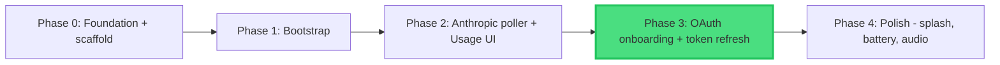
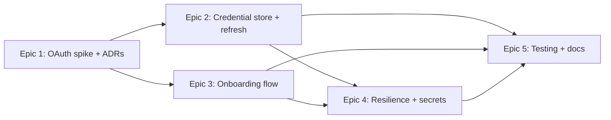

# Phase Dependencies

## Dependency Graph



**Renumbering:** the original roadmap in `1_PROJECT_OVERVIEW.md` had Phase 3 =
Polish. Phase 2 hardware testing showed OAuth onboarding + refresh is
MVP-blocking (the device dies within a day without it), whereas Polish is not.
So OAuth onboarding becomes **Phase 3** and Polish moves to **Phase 4**.

## Phase Relationships

| Phase   | Depends On | Blocks   | Status                         |
| ------- | ---------- | -------- | ------------------------------ |
| Phase 0 | None       | Phase 1  | Complete                       |
| Phase 1 | Phase 0    | Phase 2  | Complete                       |
| Phase 2 | Phase 1    | Phase 3  | Code-complete; OAuth pivot done |
| Phase 3 | Phase 2    | Phase 4  | Planning                       |
| Phase 4 | Phase 3    | None     | Not started (was "Phase 3 Polish") |

## Intra-Phase Dependencies (Phase 3 epics)



- **Epic 1 (spike + ADRs)** gates everything — it resolves the OAuth client_id,
  endpoints, refresh-grant shape, the onboarding-mechanism ADR, and the
  refresh-token storage ADR. No firmware is written against OAuth internals
  until it lands.
- **Epic 2 (refresh)** is onboarding-method-independent; it can begin as soon as
  the spike's parameters (1.1) and refresh proof (1.2) are in hand.
- **Epic 3 (onboarding)** is shaped by the Epic 1.3 ADR.
- **Epics 4 and 5** depend on 2 + 3.

## Critical Path

```
Phase 2 -> Epic 1 (spike) -> Epic 2 (refresh) + Epic 3 (onboarding)
        -> Epic 4 -> Epic 5 -> Phase 4
```

The highest-risk node is **Epic 1** — if no viable standalone OAuth flow
exists, the phase and the standalone-device premise need a rethink with the
user. It is sequenced first so that surfaces before any effort is sunk.

**Estimated timeline:** Phase 3 ≈ 1.5-2 weeks at evening/weekend pace (18 tasks;
the spike epic is the most uncertain). Phase 4 (Polish) is not yet broken down —
run `/2_pm` for it when Phase 3 completes.

---

**Note:** Update this graph when planning Phase 4.
